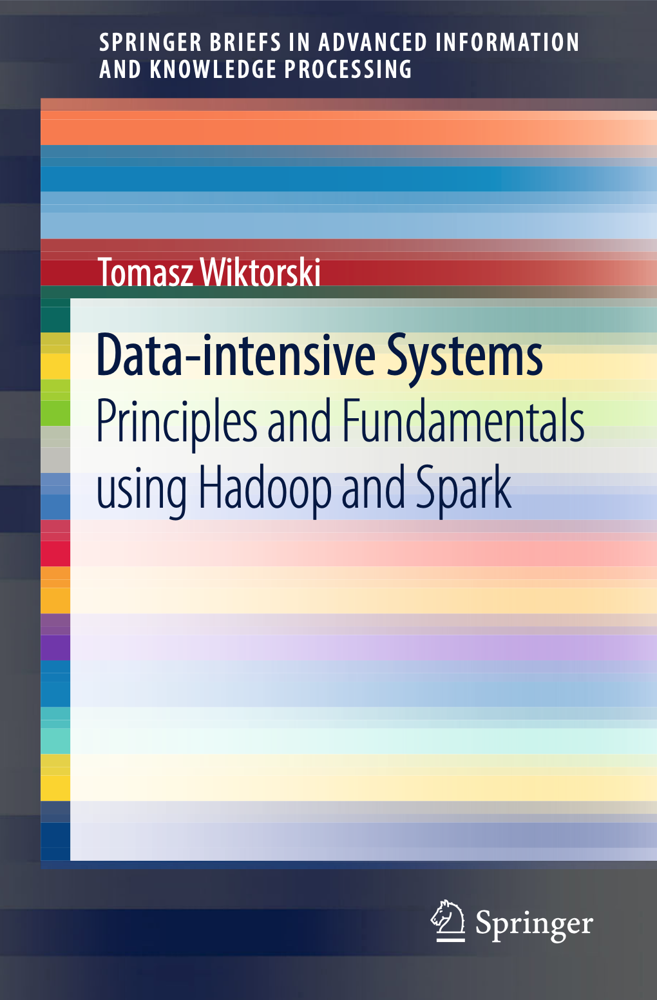

# Data-intensive Systems, Principles and Fundamentals using Hadoop and Spark
This is a repository for a Spring book Data-intensive Systems, Principles and Fundamentals using Hadoop and Spark.

The book is authored by Tomasz Wiktorski, Associate Professor at the University of Stavanger, Norway.

The repository hosts various example code and data files used in the book. It may also host errata or minor updates to the contents of the book.

ISBN 978-3-030-04602-6 (Print)  
ISBN 978-3-030-04603-3 (eBook)  
https://doi.org/10.1007/978-3-030-04603-3  
Library of Congress Control Number: 2018962384

